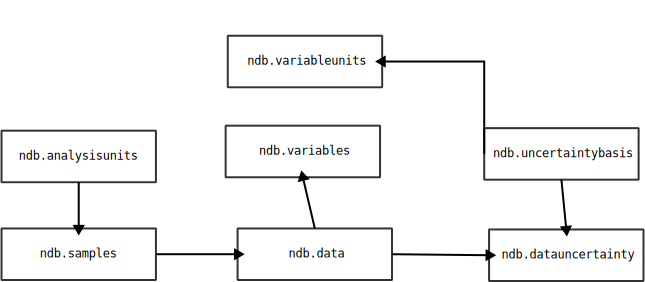

# Adding Uncertainty to Neotoma

The use of uncertainty for measured values is critical. We need it directly associated with individual measurements, and we need to identify the type of uncertainty, and, potentially, the source of the uncertainty (methods of calculation, etc.). This means that for any uncertainty measurement we need to have a link to the sample and the variable that is being measured, we need to have some set of fixed uncertainty measures (standard deviations, standard errors), we also need to be able to freely define the source of the uncertainty (or perhaps again have a fixed set of measures). So, it should be possible to report the following:

| reference                      | value | units | uncertainty reported | source                                  |
|--------------------------------|-------|-------|----------------------|-----------------------------------------|
| Pinus count for sample 1223445 | 12    | NISP  | 1SD                  | Mahr Nomograms (cf. Maher Jr 1972)      |
| pH for sample 23244            | .02   | pH    | 95% CI               | Reported instrumental error from device |
| NaOH for sample 23244          | .02   | ug    | 95% CI               | Reported instrumental error from device |

## Table modifications

The uncertainty must be linked with the `ndb.data.dataid` because it modifies the `ndb.data.value` for that variable & sample. If we can assume that the units for the uncertainty are equivalent to the units associated with the variable, however it is possible that uncertainty may be expressed as a percent value. Given this, we will create a new table that links the `ndb.data.dataid` primary key. This allows us to traverse the `ndb.variables` entry for the record (to retrieve the taxonomic information), and potentially link to the variable units if they are equivalent.

Given this data model:

* The table `ndb.data` remains as is.
* The table `ndb.variables` remains as is.
* We add a new table `ndb.datauncertainties` that uses fk(dataid) (the `fk(variableid)` is implied).
  * The table has columns `uncertaintyvalue`, `uncertaintyunit`, `uncertaintybasisid` and `notes` along with the standard `recdatecreated` and `recdatemodified`.

They will inherit information from the `ndb.variables` row, so the assumption is that the uncertainty is reported in the same units (and for the same taxon) as the `ndb.data.value`.



### Example Table

| column | type    | nulls | default | children | parents  | comments   |
|---------------------|---------|-------|---------|----------|----------|------------|
| dataid | integer | F     | null    |          | ndb.data | fk(dataid) |
| uncertaintyvalue   | float | F | | | | | The value is required. |
| uncertaintyunit   | float | F | | | | | The value is required. |
| uncertaintybasisid | integer | F | | | | ndb.uncertaintybases | |
| notes              | text | T | null | | | |

#### Proposed `ndb.uncertaintybasis.uncertaintybasis` values

Proposed values for uncertainty tables will come from standard reporting of uncertainty.

* 1 Standard Deviation
* 2 Standard Deviations
* 3 Standard Deviations
* Mean square error

```SQL
CREATE TABLE IF NOT EXISTS ndb.uncertaintybases (
    uncertaintybasisid SERIAL PRIMARY KEY,
    uncertaintybasis text,
    CONSTRAINT uniquebasis UNIQUE (uncertaintybasis))
)
INSERT INTO ndb.uncertaintybases (uncertaintybasis)
VALUES ('1 Standard Deviation'),
       ('2 Standard Deviations'),
       ('3 Standard Deviation'),
       ('1 Standard Error');
```

### Proposed `ndb.datauncertainties` structure

| uncertaintybasisid | uncertaintybasis | . . . |

```SQL
CREATE TABLE IF NOT EXISTS ndb.datauncertainties (
    dataid INTEGER REFERENCES ndb.data(dataid),
    uncertaintyvalue float,
    uncertaintyunitid integer REFERENCES ndb.variableunits(variableunitsid),
    uncertaintybasisid integer REFERENCES ndb.uncertaintybases(uncertaintybasisid),
    notes text,
    CONSTRAINT uniqueentryvalue UNIQUE (dataid, uncertaintyunitid, uncertaintybasisid)
);
```
